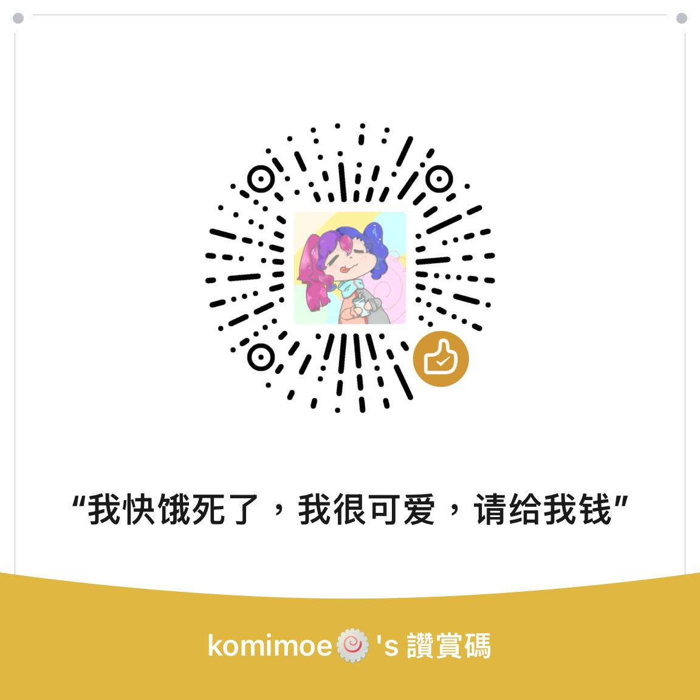

<div align="center">
  
# 👋 你好！Hi there! 

### 我是 komimoe | I'm komimoe
*一个可爱的系统程序员 & 安全研究员 | A Cute System Programmer & Security Researcher* 💕

[](https://git.io/typing-svg)

</div>

---

## 🔍 关于我 | About Me

```c
struct Developer {
    const char* name;
    const char* role;
    const char* location;
    const char* interests[6];
    const char* current_focus;
    bool is_cute;
};

struct Developer komimoe = {
    .name = "komimoe",
    .role = "可爱的系统程序员 & 安全研究员",
    .location = "互联网的某个角落",
    .interests = {
        "底层编程",
        "二进制漏洞利用",
        "逆向工程",
        "操作系统内核",
        "漏洞研究",
        "Rust语言学习中 🦀"
    },
    .current_focus = "深入研究系统架构和安全",
    .is_cute = true  // 这很重要！
};
```

## 💻 技术栈 | Tech Stack

<div align="center">

### 编程语言 | Programming Languages
     

### 安全与逆向 | Security & Reverse Engineering
    

### 工具与平台 | Tools & Platforms
   

</div>

## 🚀 当前专注 | Current Focus

- 🔭 专注于底层系统项目和安全研究
- 🦀 正在学习 Rust 语言，感受内存安全的魅力
- 🌱 探索高级漏洞利用技术和内核机制
- 👯 欢迎在安全工具和逆向工程项目上合作
- 💬 乐于讨论系统编程、二进制分析或安全相关的任何话题
- ⚡ 趣事：我在调试器里的时间比浏览器里还多！
- 💕 别看我研究安全，其实我超可爱的呢~

## 💰 赞助支持 | Support Me

如果你觉得我的项目对你有帮助，可以请我喝杯咖啡哦~（孩子快饿死了，给点钱吃饭吧） ☕

<div align="center">

### 微信赞赏码



*感谢你的支持，让可爱的我能继续产出优质内容！* 💖

</div>
